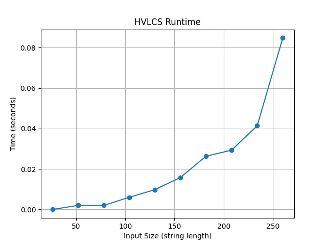

# Programming Assignment 3

## Student Info

- **Name:** Helen Dang  
- **UFID:**  58380926

---

## How to Run

Make sure you are using **Python 3.6 or higher**.

From the base directory (`./PA-3/`), run:

```bash
python main.py inputs/<inputs_file>
```

For example:

```bash
python main.py inputs/example1.in
```

Expected printed output in the terminal:

```text
9
cb
```

<br>

### Question 1

<div align="center">
<br>
      
    </div> 
    </li>
    <br>

<br>

The runtime graph was created using at least 10 nontrivial input files where both strings had length at least 25.

From the graph, the runtime increases as the input size increases, and the growth is not linear.

Since the DP table size depends on both string lengths, the total number of operations grows roughly with the product of the two lengths. This explains why the runtime starts small but increases more noticeably as the strings get larger.

### Question 2


Let `a` and `b` be the strings, indexed by `i` and `j`.
Let `w` be the value of each character.

```
OPT(i, j) = 0                               if i == 0 or j == 0
OPT(i, j) = max(OPT(i-1, j), OPT(i, j-1))  if a[i] != b[j]
OPT(i, j) = OPT(i-1, j-1] + w[a[i]]        if a[i] == b[j]
```

The base case happens when one of the strings is empty. If either string has length `0`, then there is no common subsequence, so the maximum value is `0`.

If `a[i] == b[j]`, then that character can be included in the common subsequence. Because the character values are nonnegative, adding a matching character will not make the solution worse, so we add its value to the best solution for the smaller prefixes.

If `a[i] != b[j]`, then the optimal solution must come from either skipping the current character in `a` or skipping the current character in `b`. Therefore, we take the maximum of those two possibilities.

This recurrence correctly considers all cases and builds the best value for every prefix pair.

### Question 3

Let `a` be a string of length `n`.

Let `b` be a string of length `m`.

Let `w` be the character values.

```
Create a 2D array dp of size (n+1) x (m+1), initialized to 0.

for i from 1 to n:
    for j from 1 to m:
        if a[i] == b[j]:
            dp[i][j] = dp[i-1][j-1] + w[a[i]]
        else:
            dp[i][j] = max(dp[i-1][j], dp[i][j-1])

return dp[n][m]

```

Runtime:

The DP table has `(n+1) * (m+1)` entries, and each entry is computed in constant time.

Time Complexity: `O(n * m)`

Space Complexity

The algorithm stores the full DP table.

Space Complexity: `O(n * m)`
